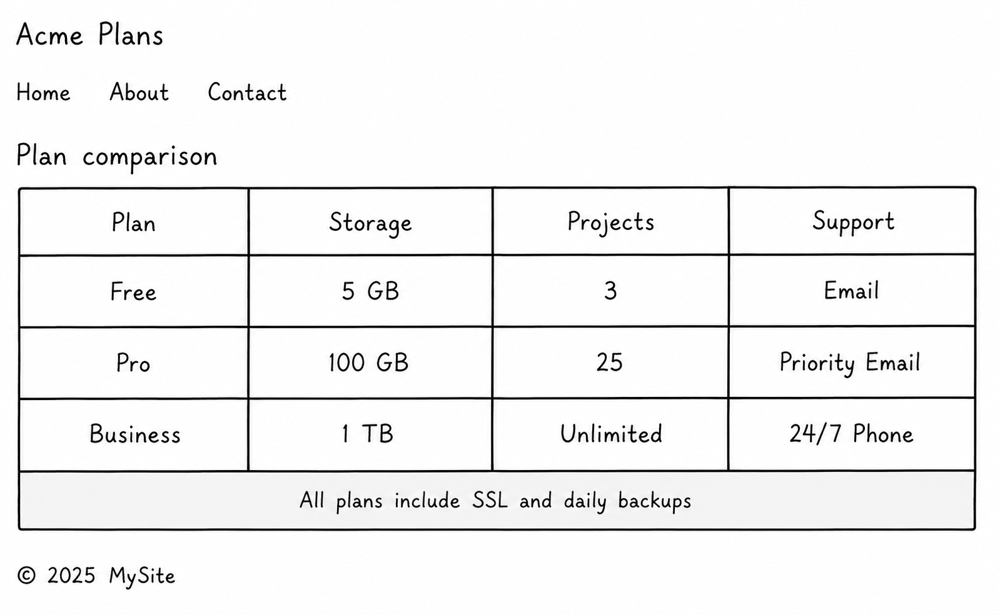

# Pricing Comparison Table

**A pricing comparison table built with semantic HTML and CSS.**

[Live website](https://michel-rooney.github.io/pricing-comparison-table/) · [Project brief](https://roadmap.sh/projects/pricing-comparison-table)

## Overview

This project is a beginner-friendly front-end exercise from [roadmap.sh](https://roadmap.sh). The goal is to build a clean pricing comparison table that is readable, well-structured, and accessible using only HTML and CSS.

It focuses on semantic table markup, strong visual hierarchy, and a simple static layout compatible with GitHub Pages deployment.

## Features

- Clean pricing table layout for multiple plans
- Semantic HTML structure with table headers and body sections
- Accessibility improvements using `scope` attributes
- Simple responsive styling centered on the page
- Static deployment with GitHub Pages

## Preview

## Built With

- HTML5
- CSS3
- GitHub Pages

## Links

- [Live website](https://michel-rooney.github.io/pricing-comparison-table/)
- [GitHub repository](https://github.com/Michel-Rooney/pricing-comparison-table)
- [roadmap.sh project](https://roadmap.sh/projects/pricing-comparison-table)
